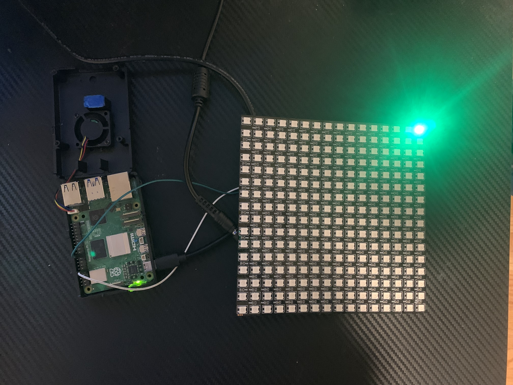
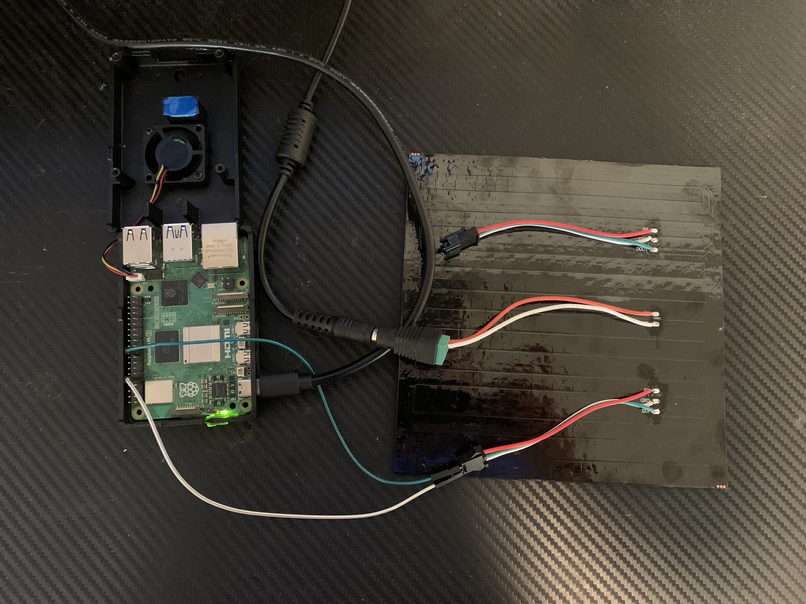

## Control WS2812B LED Matrix using your Raspberry Pi 5
This Repository contains a Driver for the new Raspberry Pi 5 RP1 Peripheral chip that can be used to control your WS2812b LEDs

### To Run Example which turns on 1st LED Green:
    1. Ensure hardware connections are made as shown in Image 1
    2. $ gcc rp1Spi.c rp1SpiUtil.c pi5ws2812b.c -o run
    3. $ sudo ./run

Result:

#### Image 1

